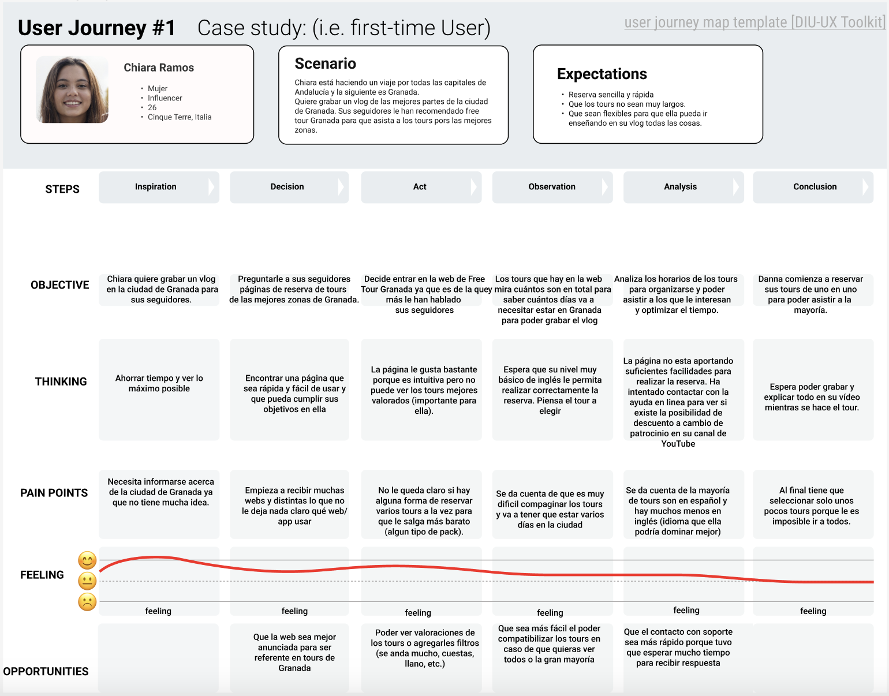

## DIU - Practica1, entregables

## Paso 1. UX Desk Research & Analisis 

 1.a Competitive Analysis

>>> Las aplicaciones elegidas son las siguientes: 
>>> Get Your Guide: Líder internacional en planificación de viajes. Página muy profesional, con buena interfaz y funcionalidad. 
>>> Granada Tours: Página de tours de Granada. Elegida porque se puede considerar un rival directo. Bastante mejorable en general. 
>>> Civitatis: Lider en distribución de actividades en español. Calidad muy alta, similar a Get Your Guide

 1.b Persona
-----

>>> Grisha nos sirve para ver como interactuaría con nuestra página el colectivo de personas mayores, con poca cultura tecnológica, o con barreras como el idioma. Muchos turistas que se pueden ver interesados en estos tours forman parte de este grupo.

>>> Por el contrario, Chiara representa el grupo de personas jovenes, con muchos conocimientos sobre las nuevas tecnologías, y que se interesan en viajar y compartir sus experiencias en redes sociales. Para ellos, realizar una reserva online no supone un gran problema, pero pueden ser críticos con la apariencia de la página y sus velocidad de carga y uso.

 1.c User Journey Map
----

>>> La experiencia de usuario de Grisha puede ser bastante común. Personas mayores, que no tienen mucha experiencia navegando por internet, y que necesitan ayuda para realizar ciertas tareas. De igual forma, el idioma es muy importante ya que limitará enormemente la experiencia en la página.

>>> Muchos usuarios como Chiara pueden visitar nuestra página. Es importante que se sientan cómodos, con una interfaz llamativa y moderna, así como una usabilidad intuitiva y con bajos tiempos de carga. Para las personas jóvenes, largos tiempos de carga pueden suponer que se marchen de la web.

 1.d Usability Review
----
>>> - Enlace al documento:  [Usability Review](https://github.com/albertord98/DIU/blob/master/P1/UsabilityReviewEx.xlsx)
>>> - Valoración final (numérica): 70.22%
>>> - Comentario sobre la valoración:  En general se trata de una página correcta, con una interfaz amigable y una usabilidad buena. Las carencias principales son los formularios, así como los errores que muestran, y la ausencia de una barra de búsqueda de tours.

**Valoración y conclusiones de esta etapa**
Tras realizar esta práctica hemos conseguido salir de nuestra forma de pensar las cosas como ingenieros (como creadores de la web) y pensar como un usuario final que puede utilizar la web y que, como todo el mundo, tendrá sus dificultades ya sea por el idioma, edad, capacidad, etc.
Esta forma de empatizar es muy buena ya que al ponerte en la piel del usuario final, intentas que todas sus necesidades, dudas, problemas sean saciados.
