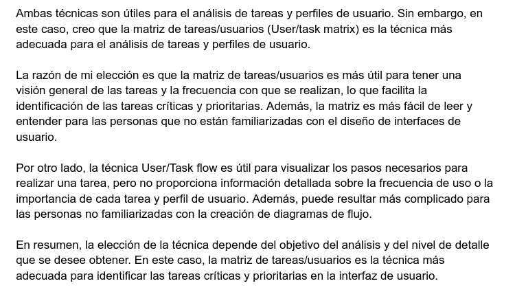

## DIU - Practica2, entregables

### Ideación 
* **Malla receptora de información** 

  Recabamos en la malla receptora de información (feedback capture grid) la información obtenida de los usuarios de la práctica 1 (y de nuestra experiencia) para así abordar el diseño. La técnica consiste en elaborar un cuadrante con 4 apartados: aspectos positivos actualmente existentes, críticas constructivas, preguntas de los usuarios (a partir de las personas ficticias), e ideas de mejora (a partir de la experiencia del equipo de desarrollo). La diferencia entre las preguntas de los usuarios y las ideas de mejora, es que un usuario no se plantea si se puede implementar o no la solución que propone

  

### PROPUESTA DE VALOR
* **ScopeCanvas**

  a breve descripción del proyecto como el LeanUX Canvas son herramientas  esenciales para cualquier proyecto de diseño de productos o servicios,  ya que ayudan a comunicar claramente el propósito y el valor del  proyecto y a visualizar el proceso completo del proyecto para  desarrollar productos o servicios que satisfagan las necesidades del  usuario de manera efectiva.

  

### TASK ANALYSIS

* User Task Matrix

  

### ARQUITECTURA DE INFORMACIÓN

 La arquitectura de información es una disciplina del diseño que se enfoca en la organización y estructuración de la información en productos o sistemas. Su objetivo principal es crear estructuras y jerarquías claras y eficientes para que los usuarios puedan encontrar la información que necesitan de manera rápida y fácil.

En otras palabras, la arquitectura de información se preocupa por cómo se organizan y presentan los contenidos y funciones de un sistema de manera que resulte fácil y cómodo para el usuario encontrar lo que busca.

Para lograr esto, se utilizan técnicas y metodologías específicas para el análisis, la planificación y el diseño de sistemas de información, que incluyen la creación de mapas de sitio, la definición de taxonomías, la realización de pruebas de usabilidad, entre otras.

La arquitectura de información es esencial en el diseño de productos digitales, ya que la eficiencia y la facilidad de uso son factores críticos para el éxito de cualquier sistema. En resumen, la arquitectura de información es una disciplina que se enfoca en la organización y estructuración de la información para crear productos o sistemas de fácil uso y navegación para los usuarios.

### Prototipo Lo-FI Wireframe 

Finalmente se ponen a disposición los prototipos/diseños Lo-Fi para hacernos una idea de lo que contendrán nuestras páginas principales.

### Conclusiones  

En este etapa hemos pasado de conocer a fondo al usuario de la aplicación (práctica 1) a darle un enfoque a la aplicación para ese tipo de usuario final. Aunque en el diseño y desarrollo de un producto, nunca se deja de estar  estar pensando y empatizando con el usuario.

