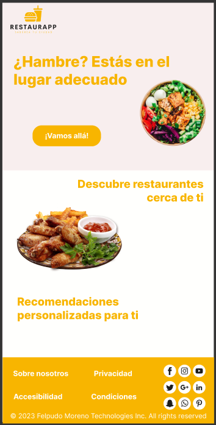
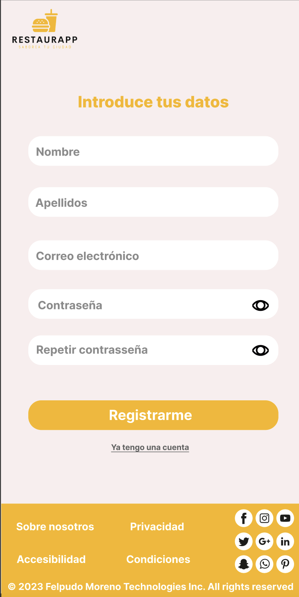
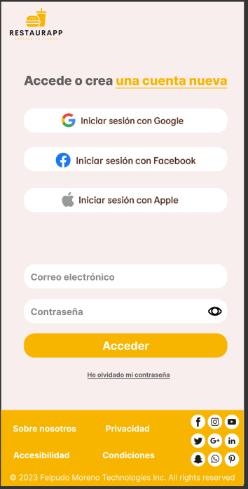
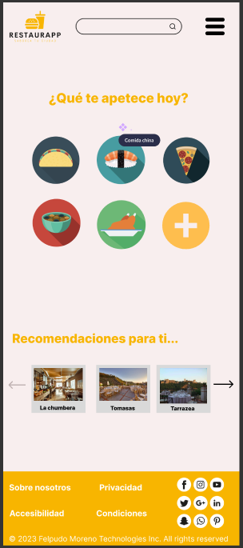
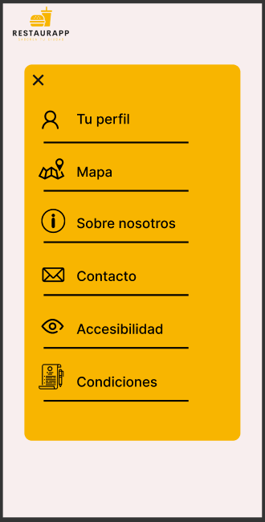
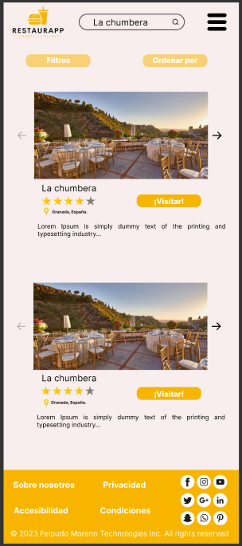
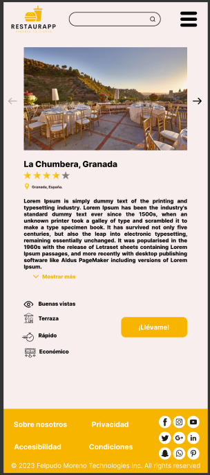
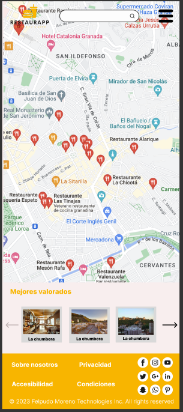
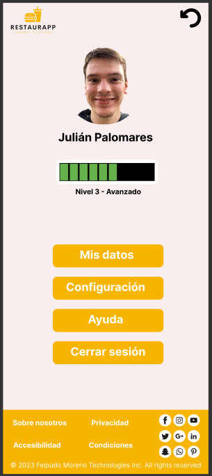

# DIU - Practica 3, entregables

## Moodboard (diseño visual + logotipo)   

La herramienta utilizada para realizar el logotipo es Looka, un creador de logos gratuito. Nos ha parecido una herramienta muy útil, sencilla y rápida, ya que permite generar una gran cantidad de logos en función de características que le añadas, así como iconos que quieres que incluya, estilos, etc. 
La resolución empleada es de 1256 × 930. 
Sería necesario emplear una resolución mas alargada para una cabecera como la de Twitter.

**Test de colores:**

## Landing Page

## Mockup: LAYOUT HI-FI

**Home o página principal** (usuario no logeado)

Esta es la pantalla por defecto que aparece cuando alguien entra por primera vez en nuestra aplicación o cuando cierra sesión. Desde esta página, clicando en el botón podremos registrarnos o iniciar sesión.

* **Página de registro**

  

* **Inicio de sesión**

El usuario podrá iniciar sesión con su cuenta (que previamente ha registrado) o podrá directamente iniciar sesión con Google, Facebook o Apple. También se pone a disposición un servicio de recuperación de contraseña (en caso de ser olvidada) vía mail.

* **Home o página principal** (usuario logeado)

En el diseño de la página principal, el usuario podrá seleccionar un restaurante por el tipo de comida que le guste, por recomendaciones diseñadas para él/ella, por sitios cercanos, etc.

Aparte, tendrá un buscador y un menú desplegable en la esquina superior derecha para que pueda navegar por todas las pestañas de nuestra aplicación.

En la parte inferior podemos observar un footer en el cual se encuentran las páginas de información junto con las redes sociales de RestaurApp.

* **Desplegable**

  

  Aquí se puede ver la ventana que se mostraría en caso de que hiciésemos clic en el menú desplegable superior, pudiendo acceder a todas las secciones de nuestra aplicación:

  * Perfil: perfil del usuario junto con sus datos y configuraciones

  * Mapa: versión de búsqueda de restaurantes en versión mapa para poder ver los más cercanos a ti

    

* **Listado de restaurantes**

  

  En el listado de restaurantes podemos observar cada uno de los sitios con algo de información (imagenes modo carrusel, nombre, valoración por reseñas, ubicación, fragmento de descripción y botón de enlace al sitio).

  Estos restaurantes se pueden filtrar por distintas características y ordenarlas por estrellas, recientes, cercanas, etc.

  

* **Detalle de restaurante**

  

  Cuando hacemos clic en un restaurante, nos lleva a la página de detalle de éste en la cual podemos ver al completo toda la información del sitio: ubicación, valoración, descripción completa junto con una serie de características a favor que describen en adjetivos al restaurante.

  

* **Búsqueda mapa**

  

  En la versión de mapa podremos ver los restaurantes más cercanos a nuestra ubicación en tiempo real junto con su valoración, distancia, etc.

  

* **Perfil**

  

  

  En nuestro perfil podremos acceder a las distintas opciones de configuración, así como poder cerrar sesión de nuestra cuenta.

## Documentación: Publicación del Case Study

(incluye) Valoración del equipo sobre la realización de esta práctica o los problemas surgidos

