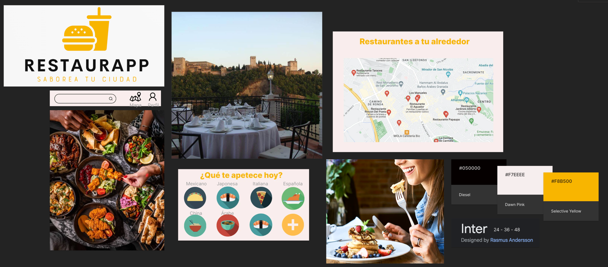
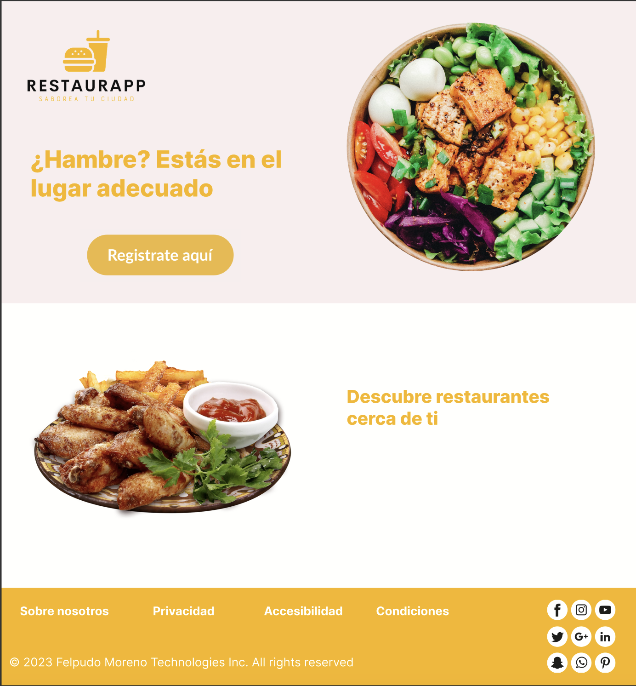

# DIU - Practica 3, entregables

## Moodboard (diseño visual + logotipo)   

La herramienta utilizada para realizar el logotipo es Looka, un creador de logos gratuito. Nos ha parecido una herramienta muy útil, sencilla y rápida, ya que permite generar una gran cantidad de logos en función de características que le añadas, así como iconos que quieres que incluya, estilos, etc. 
La resolución empleada es de 1256 × 930. 
Sería necesario emplear una resolución mas alargada para una cabecera como la de Twitter.

## Landing Page

## Mockup: LAYOUT HI-FI

## Documentación: Publicación del Case Study

(incluye) Valoración del equipo sobre la realización de esta práctica o los problemas surgidos
 
