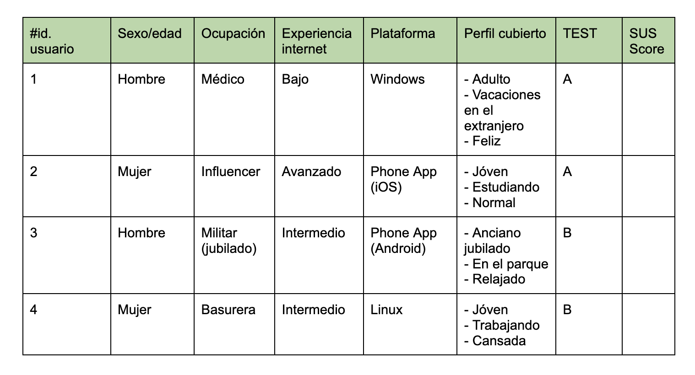
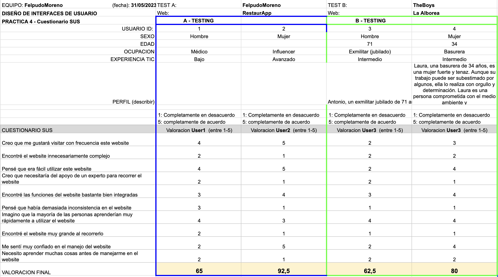
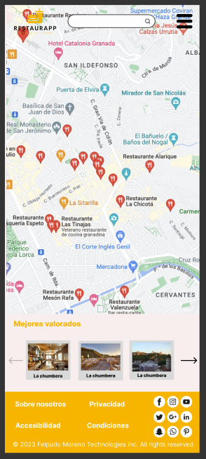
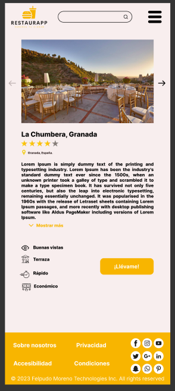

# DIU - Práctica 4 - Entregables

### Usuarios ficticiones + Rol Play

**Elección y características**

Los usuarios a utilizar serán los siguientes:

- Usuario 1: Grisha Jeager. 52 años. Se trata de un médico de nacionalidad alemana. Tiene una experiencia media-baja en internet, lo usa principalmente para reservar viajes al extranjero.
- Usuario 2: Chiara Ramos. 26 años. Influencer italiana. Tiene un alto conocimiento de la navegación en internet y del uso de las nuevas tecnologías, pues suponen una gran parte de su trabajo.
- Usuario 3: Antonio Rodríguez. 71 años. Militar retirado. Poco conocimiento de las nuevas tecnologías pero bastante para su alta edad.
- Usuario 4: Laura Jiménez. 34 años. Basurera. Le gusta aprender cosas nuevas sobre tecnología. Tiene un Samsung, y un portatil con un sistema operativo abierto, linux.

A continuación podemos ver la tabla resumen de los personajes junto con los resultados del Rol Play los cuales definen características cruciales como son: el estado y sitio en el que se encuentran nuestros protagonistas.

*Nota: El SUS Score será comentado más adelante*

Los usuarios 1 y 2 se encargarán de evaluar la aplicación de RestaurApp mediante el cuestionario SUS. 
Los usuarios 3 y 4 realizarán este cuestionario pero aplicado a la página La Alboreá

### Cuestionario SUS + Conclusiones A/B test

Tras ver los resultados, sacamos las siguientes **conclusiones**:

#### Conclusión A

A partir de la información obtenida del Cuestionario SUS podemos saber es una aplicación que a los usuarios les gustaría visitar frecuentemente, fácil de usar (no hay que aprender nada para utilizar la app) y donde las funciones y servicios se encuentran bien integradas.

Una de las cosas que más les ha gustado a los usuarios es la interfaz bonita y sencilla (sin demasiados elementos) que presenta RestaurApp.

Algunas mejoras que podrían realizarse son:

* El panel superior de la aplicación móvil debería poder integrarse mejor (forma visual) en el apartado de mapas ya que este puede ser lioso.

  

* No existen suficientes botones a lo largo de la aplicación como por ejemplo, botones para volver a la página anterior

  

* La combinación de colores podría ser mejor para fomentar un mejor contraste para personas con dificultad visual.

#### Conclusión B

Sacando conclusiones del Cuestionario SUS podemos decir que en general  presentaba una interfaz muy sencilla e intuitiva con las funciones principales de la página (comprar) bien destacadas aunque nuestros dos personajes (Antonio y Laura) no la visitarían con tanta frecuencia debido a que la aplicación trata de un tema muy específico (flamenco) y a ellos no les llama muchísimo la atención como para visitar la web regularmente.

Algunas mejoras o sugerencias realizadas por los usuarios son:

* Que se realice un diseño ajustado a dispositivos móviles ya que es el aparato por el cual muchos de los usuarios ingresan a la aplicación.
* Que se incluyan un apartado de descripción junto con reseñas/vídeos/fotos de cada show que se hace para que te hagas una idea de qué vas a ver
* Una interfaz de compra un poco liosa al mostrar los tipos de entradas que hay.
* Una interfaz un poco más vistosa.

### Usability Report (Caso B)

Se puede encontrar [aquí](https://github.com/albertord98/DIU/blob/master/P4/Informe%20de%20usabilidad.pdf)

### Conclusiones

