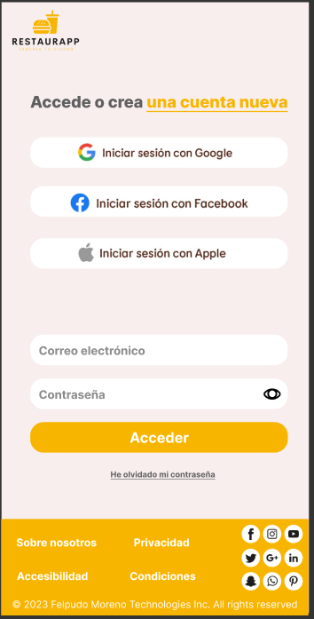
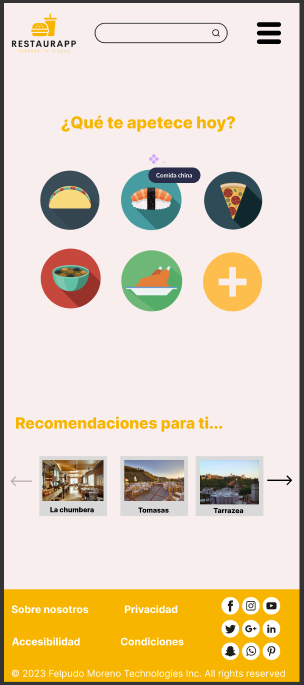
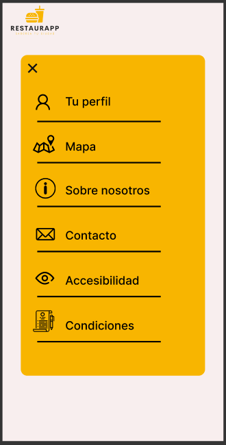
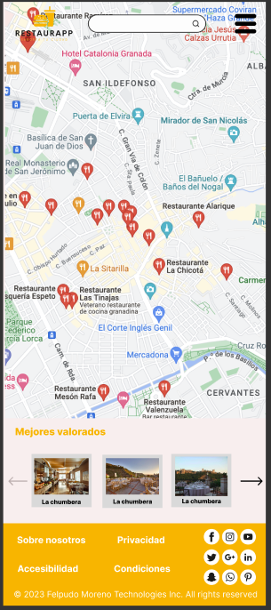

# DIU23
Prácticas Diseño Interfaces de Usuario 2022-23 (Tema: .... ) 

Grupo: DIU2.FelpudoMoreno  Curso: 2022/23 
Updated: 24/3/2023

Proyecto: 
RestaurApp

Descripción: 

RestaurApp se trata de una página turística para la recomendación de los mejores lugares para comer y cenar en tu ciudad. La pagina principal contará con una barra de búsqueda y un selector del tipo de comida que le apetece al usuario. Una vez seleccionada, se le mostrarán las opciones mejor valoradas alrededor de su zona. 

También existirá un mapa de la ciudad que mostrará los restaurantes por ubicación.

Logotipo: 

Miembros
 * :bust_in_silhouette:   Alberto Miguel Rodríguez Díaz     :octocat:     
 * :bust_in_silhouette:  Abel Ríos Gonzalez     :octocat:

-----

# Proceso de Diseño 

## Paso 1. UX Desk Research & Analisis 

 1.a Competitive Analysis
-----

>>> Las aplicaciones elegidas son las siguientes: 
>>> Get Your Guide: Líder internacional en planificación de viajes. Página muy profesional, con buena interfaz y funcionalidad. 
>>> Granada Tours: Página de tours de Granada. Elegida porque se puede considerar un rival directo. Bastante mejorable en general. 
>>> Civitatis: Lider en distribución de actividades en español. Calidad muy alta, similar a Get Your Guide

 1.b Persona
-----

>>> Grisha nos sirve para ver como interactuaría con nuestra página el colectivo de personas mayores, con poca cultura tecnológica, o con barreras como el idioma. Muchos turistas que se pueden ver interesados en estos tours forman parte de este grupo.

>>> Por el contrario, Chiara representa el grupo de personas jovenes, con muchos conocimientos sobre las nuevas tecnologías, y que se interesan en viajar y compartir sus experiencias en redes sociales. Para ellos, realizar una reserva online no supone un gran problema, pero pueden ser críticos con la apariencia de la página y sus velocidad de carga y uso.

 1.c User Journey Map
----

>>> La experiencia de usuario de Grisha puede ser bastante común. Personas mayores, que no tienen mucha experiencia navegando por internet, y que necesitan ayuda para realizar ciertas tareas. De igual forma, el idioma es muy importante ya que limitará enormemente la experiencia en la página.

>>> Muchos usuarios como Chiara pueden visitar nuestra página. Es importante que se sientan cómodos, con una interfaz llamativa y moderna, así como una usabilidad intuitiva y con bajos tiempos de carga. Para las personas jóvenes, largos tiempos de carga pueden suponer que se marchen de la web.

 1.d Usability Review
----
>>> - Enlace al documento:  [Usability Review](https://github.com/albertord98/DIU/blob/master/P1/Usability-review-template.xlsx)
>>> - Valoración final (numérica): 70.22%
>>> - Comentario sobre la valoración:  En general se trata de una página correcta, con una interfaz amigable y una usabilidad buena. Las carencias principales son los formularios, así como los errores que muestran, y la ausencia de una barra de búsqueda de tours.

## Paso 2. UX Design  

 2.a Feedback Capture Grid / EMpathy map / POV
----

 Interesante | Críticas     
| ------------- | -------
  Preguntas | Nuevas ideas

>>> ¿Que planteas como "propuesta de valor" para un nuevo diseño de aplicación para economia colaborativa ?
>>> Problema e hipótesis
>>>  Que planteas como "propuesta de valor" para un nuevo diseño de aplicación para economia colaborativa te
>>> (150-200 caracteres)

 2.b ScopeCanvas
----
>>> Propuesta de valor 

 2.b Tasks analysis 
-----

 2.c IA: Sitemap + Labelling 
----

>>> Sitemap

>>> Labeling

 2.d Wireframes
-----

>>> Landing page

>>> Búsqueda por categoria

>>> Búsqueda por termino

>>> Búsqueda por ubicación

>>> Ejemplo de restaurante

>>> Mi perfil

## Paso 3. Mi UX-Case Study (diseño)

 3.a Moodboard
-----

La herramienta utilizada para realizar el logotipo es Looka, un creador de logos gratuito. Nos ha parecido una herramienta muy útil, sencilla y rápida, ya que permite generar una gran cantidad de logos en función de características que le añadas, así como iconos que quieres que incluya, estilos, etc. 
La resolución empleada es de 1256 × 930. 
Sería necesario emplear una resolución mas alargada para una cabecera como la de Twitter.

La fuente empleada en la totalidad de la aplicación es “Inter”, desarrollada por Rasmus Andersson, con tamaños que varían entre 18, 22, 26, 32, 36 y 48.
Los colores elegidos serán distintas gamas de negros y grises (para textos), Dawn Pink #F7EEEE para los fondos principales, y Amarillo #F8B500 para elementos a destacar.
Finalmente empleamos una selección de logotipos que incluyen botones para la selección del tipo de restaurante (japonés, italiano…), enlaces a las secciones de mapa y perfil, menú desplegable, vuelta atrás e iconos de redes sociales

  3.b Landing Page
----

La idea que hemos seguido con la landing page era la de mantener un estilo limpio y sencillo, dándole especial importancia a la temática de la aplicación y al botón de registro.

Elementos importantes que la componen serían, primero, el logotipo de la marca, títulos que llamen la atención del cliente 
e imágenes llamativas sobre la temática de la aplicación.

Añadimos también el footer con su respectiva información.

 3.c Guidelines
----

Pretendemos realizar un diseño minimalista, con suficiente espacio en blanco, iconos, enlaces y botones claros y sencillos. 
Hemos adaptado el diseño web a dispositivos móviles ya que será la plataforma principal por la cual nuestros usuarios utilizarán la aplicación debido a que se encontrarán la mayoría de las veces en el exterior teniendo como dispositivo más cercano, el móvil.

Para el diseño hemos empleado los siguientes patrones:

Con respecto a la recolección de datos, a todos los campos de entrada de datos les incorporamos “input hints”, de forma que no surjan confusiones en los usuarios sobre qué información introducir en cada apartado.

Utilizamos el ya muy extendido patrón de “social login”, en el cual se simplifica el acceso a tu cuenta en uno u dos pasos.

Finalmente, empleamos las “contact forms” en el apartado de contacto, para dar un medio rápido al cliente de contactar con nosotros.

Con respecto a los controles de usuario, se emplearán “context menus” en los restaurantes mostrados en el mapa. De esta forma, al pulsar uno de ellos, se mostrarán las distintas funciones que se pueden realizar, como visitar su página, crear una ruta hacia allí, etc.

Finalmente, con respecto a la navegación, empleamos barras de búsqueda, en caso de que el usuario tenga una consulta más específica y no sepa dónde está o cómo encontrarla.

Empleamos también “fixed-navigation”, de forma que el logo de la aplicación, la barra de búsqueda y el menú se queden siempre en lo alto de la pantalla al hacer scroll. De esta forma se tendrán siempre a mano las funciones principales. 

Para el menú desplegable utilizamos la técnica de los “slideouts”. Al hacer click en el icono correspondiente, se desplegarán las diversas funcionalidades y enlaces de la aplicación. 

Para el landing page, y la página de selección de comidas empleamos “Calls to Action”. Tanto con el botón de registro como con los de tipos de restaurantes estamos mostrando un siguiente paso claro en la navegación de la página. 

En algunas secciones de la aplicación se muestran también recomendaciones de restaurantes que podrían interesar al usuario. De esta forma tardarán menos tiempo en encontrar opciones que les gusten. Las recomendaciones las colocamos en forma de carrusel, mostrándose simultáneamente 3 en pantalla.

Al enfocar la web a dispositivos móviles, seguiremos las guidelines aportadas por material.io para vistas de Android.

  3.d Mockup
----

**Home o página principal** (usuario no logeado)

Esta es la pantalla por defecto que aparece cuando alguien entra por primera vez en nuestra aplicación o cuando cierra sesión. Desde esta página, clicando en el botón podremos registrarnos o iniciar sesión.

* **Página de registro**

  

* **Inicio de sesión**

El usuario podrá iniciar sesión con su cuenta (que previamente ha registrado) o podrá directamente iniciar sesión con Google, Facebook o Apple. También se pone a disposición un servicio de recuperación de contraseña (en caso de ser olvidada) vía mail.

* **Home o página principal** (usuario logeado)

En el diseño de la página principal, el usuario podrá seleccionar un restaurante por el tipo de comida que le guste, por recomendaciones diseñadas para él/ella, por sitios cercanos, etc.

Aparte, tendrá un buscador y un menú desplegable en la esquina superior derecha para que pueda navegar por todas las pestañas de nuestra aplicación.

En la parte inferior podemos observar un footer en el cual se encuentran las páginas de información junto con las redes sociales de RestaurApp.

* **Desplegable**

  

  Aquí se puede ver la ventana que se mostraría en caso de que hiciésemos clic en el menú desplegable superior, pudiendo acceder a todas las secciones de nuestra aplicación:

  * Perfil: perfil del usuario junto con sus datos y configuraciones

  * Mapa: versión de búsqueda de restaurantes en versión mapa para poder ver los más cercanos a ti

    

* **Listado de restaurantes**

  

  En el listado de restaurantes podemos observar cada uno de los sitios con algo de información (imagenes modo carrusel, nombre, valoración por reseñas, ubicación, fragmento de descripción y botón de enlace al sitio).

  Estos restaurantes se pueden filtrar por distintas características y ordenarlas por estrellas, recientes, cercanas, etc.

  

* **Detalle de restaurante**

  

  Cuando hacemos clic en un restaurante, nos lleva a la página de detalle de éste en la cual podemos ver al completo toda la información del sitio: ubicación, valoración, descripción completa junto con una serie de características a favor que describen en adjetivos al restaurante.

  

* **Búsqueda mapa**

  

  En la versión de mapa podremos ver los restaurantes más cercanos a nuestra ubicación en tiempo real junto con su valoración, distancia, etc.

  

* **Perfil**

  

 3.e ¿My UX-Case Study?
-----

El despliegue de la página se ha realizado con github pages en https://albertord98.github.io/DIU/

**Problemas surgidos:**

- El libro de “Web UI DEsign Patterns 2016” no nos dejaba descargarlo desde https://www.uxpin.com/studio/ebooks/web-ui-design-patterns-2016-volume-1/ porque no nos llegaba al correo y hemos tenido que buscarlo en otro sitio.
- Tuvimos un problema a la hora de la elección de los colores primarios de la aplicación ya que no le hicimos el test de contraste justo después de elegirlos, lo que provocó que no pudiéramos cambiar los wireframes y diseños de las páginas a tiempo.
- Github nos ha dado problemas a la hora de insertar imágenes a los readme, el más molesto siendo que estos no se actualizaban al sobrescribir una imagen. Esto pasaba alguna por cargarse la caché del navegador y otras por razones que desconocemos.
- Tuvimos varios retrasos en los diseños móvil de la web ya que muchas veces no nos decidíamos cuál era la mejor opción.
- Problemas a la hora de estandarizar estilos, ya sean tamaños de fuente, dimensiones de campos de texto, botones, secciones de las distintas páginas, etc

## Paso 4. Evaluación 

 4.a Caso asignado
----

>>> Breve descripción del caso asignado con enlace a  su repositorio Github

 4.b User Testing
----

>>> Seleccione 4 personas ficticias. Exprese las ideas de posibles situaciones conflictivas de esa persona en las propuestas evaluadas. Asigne dos a Caso A y 2 al caso B

| Usuarios | Sexo/Edad     | Ocupación   |  Exp.TIC    | Personalidad | Plataforma | TestA/B
| ------------- | -------- | ----------- | ----------- | -----------  | ---------- | ----
| User1's name  | H / 18   | Estudiante  | Media       | Introvertido | Web.       | A 
| User2's name  | H / 18   | Estudiante  | Media       | Timido       | Web        | A 
| User3's name  | M / 35   | Abogado     | Baja        | Emocional    | móvil      | B 
| User4's name  | H / 18   | Estudiante  | Media       | Racional     | Web        | B 

. 4.c Cuestionario SUS
----

>>> Usaremos el **Cuestionario SUS** para valorar la satisfacción de cada usuario con el diseño (A/B) realizado. Para ello usamos la [hoja de cálculo](https://github.com/mgea/DIU19/blob/master/Cuestionario%20SUS%20DIU.xlsx) para calcular resultados sigiendo las pautas para usar la escala SUS e interpretar los resultados
http://usabilitygeek.com/how-to-use-the-system-usability-scale-sus-to-evaluate-the-usability-of-your-website/)
Para más información, consultar aquí sobre la [metodología SUS](https://cui.unige.ch/isi/icle-wiki/_media/ipm:test-suschapt.pdf)

>>> Adjuntar captura de imagen con los resultados + Valoración personal 

 4.d Usability Report
----

>> Añadir report de usabilidad para práctica B (la de los compañeros)

>>> Valoración personal 

>>> ## Paso 5. Evaluación de Accesibilidad  (no necesaria)

>>>   5.a Accesibility evaluation Report 
>>>> ----

>>> Indica qué pretendes evaluar (de accesibilidad) sobre qué APP y qué resultados has obtenido 

>>> 5.a) Evaluación de la Accesibilidad (con simuladores o verificación de WACG) 
>>> 5.b) Uso de simuladores de accesibilidad 

>>> (uso de tabla de datos, indicar herramientas usadas) 

>>> 5.c Breve resumen del estudio de accesibilidad (de práctica 1) y puntos fuertes y de mejora de los criterios de accesibilidad de tu diseño propuesto en Práctica 4.

## Conclusión final / Valoración de las prácticas

>>> (90-150 palabras) Opinión del proceso de desarrollo de diseño siguiendo metodología UX y valoración (positiva /negativa) de los resultados obtenidos  

