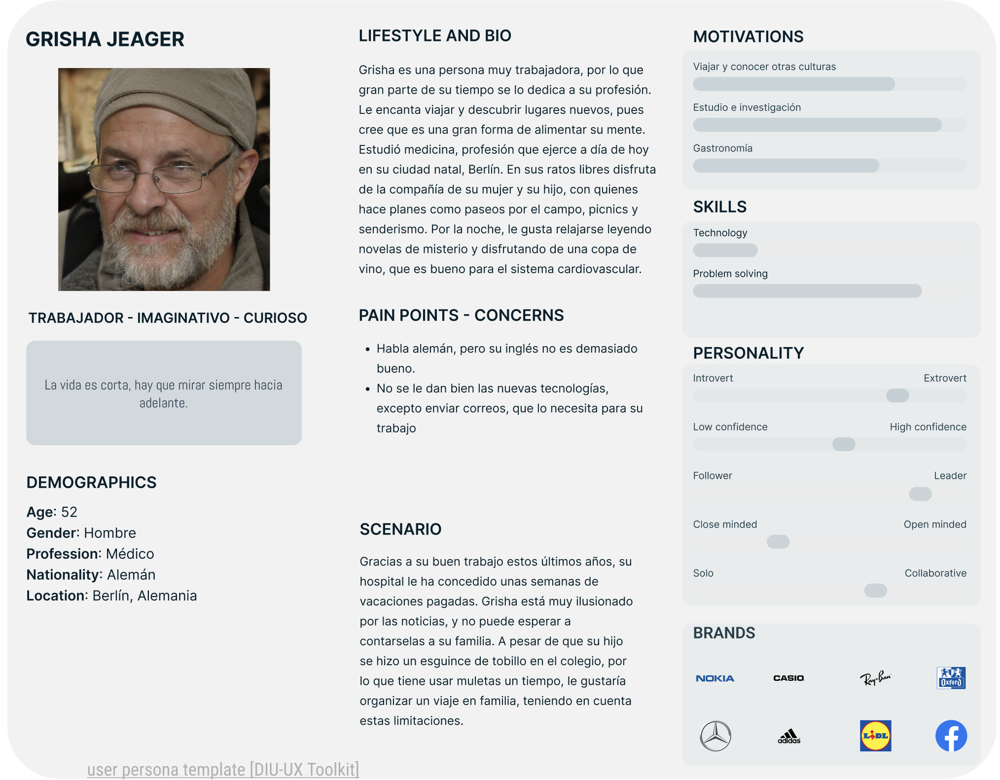
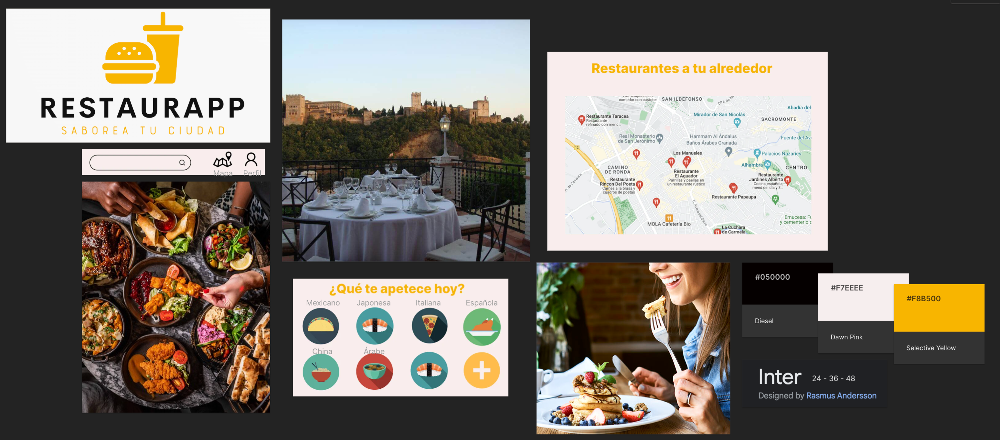

# DIU23
Prácticas Diseño Interfaces de Usuario 2022-23 (Tema: .... ) 

Grupo: DIU2.FelpudoMoreno  Curso: 2022/23 
Updated: 24/3/2023

Proyecto: 
RestaurApp

Descripción: 

RestaurApp se trata de una página turística para la recomendación de los mejores lugares para comer y cenar en tu ciudad. La pagina principal contará con una barra de búsqueda y un selector del tipo de comida que le apetece al usuario. Una vez seleccionada, se le mostrarán las opciones mejor valoradas alrededor de su zona. 

También existirá un mapa de la ciudad que mostrará los restaurantes por ubicación.

Logotipo: 

Miembros
 * :bust_in_silhouette:   Alberto Miguel Rodríguez Díaz     :octocat:     
 * :bust_in_silhouette:  Abel Ríos Gonzalez     :octocat:

----- 

# Proceso de Diseño 

## Paso 1. UX Desk Research & Analisis 

 1.a Competitive Analysis
-----

>>> Las aplicaciones elegidas son las siguientes: 
>>> Get Your Guide: Líder internacional en planificación de viajes. Página muy profesional, con buena interfaz y funcionalidad. 
>>> Granada Tours: Página de tours de Granada. Elegida porque se puede considerar un rival directo. Bastante mejorable en general. 
>>> Civitatis: Lider en distribución de actividades en español. Calidad muy alta, similar a Get Your Guide

 1.b Persona
-----

>>> Grisha nos sirve para ver como interactuaría con nuestra página el colectivo de personas mayores, con poca cultura tecnológica, o con barreras como el idioma. Muchos turistas que se pueden ver interesados en estos tours forman parte de este grupo.

>>> Por el contrario, Chiara representa el grupo de personas jovenes, con muchos conocimientos sobre las nuevas tecnologías, y que se interesan en viajar y compartir sus experiencias en redes sociales. Para ellos, realizar una reserva online no supone un gran problema, pero pueden ser críticos con la apariencia de la página y sus velocidad de carga y uso.

 1.c User Journey Map
----

>>> La experiencia de usuario de Grisha puede ser bastante común. Personas mayores, que no tienen mucha experiencia navegando por internet, y que necesitan ayuda para realizar ciertas tareas. De igual forma, el idioma es muy importante ya que limitará enormemente la experiencia en la página.

>>> Muchos usuarios como Chiara pueden visitar nuestra página. Es importante que se sientan cómodos, con una interfaz llamativa y moderna, así como una usabilidad intuitiva y con bajos tiempos de carga. Para las personas jóvenes, largos tiempos de carga pueden suponer que se marchen de la web.

 1.d Usability Review
----
>>> - Enlace al documento:  [Usability Review](https://github.com/albertord98/DIU/blob/master/P1/Usability-review-template.xlsx)
>>> - Valoración final (numérica): 70.22%
>>> - Comentario sobre la valoración:  En general se trata de una página correcta, con una interfaz amigable y una usabilidad buena. Las carencias principales son los formularios, así como los errores que muestran, y la ausencia de una barra de búsqueda de tours.

## Paso 2. UX Design  

 2.a Feedback Capture Grid / EMpathy map / POV
----

 Interesante | Críticas     
| ------------- | -------
  Preguntas | Nuevas ideas
  
    
>>> ¿Que planteas como "propuesta de valor" para un nuevo diseño de aplicación para economia colaborativa ?
>>> Problema e hipótesis
>>>  Que planteas como "propuesta de valor" para un nuevo diseño de aplicación para economia colaborativa te
>>> (150-200 caracteres)

 2.b ScopeCanvas
----
>>> Propuesta de valor 

 2.b Tasks analysis 
-----

 2.c IA: Sitemap + Labelling 
----

>>> Sitemap

>>> Labeling

 2.d Wireframes
-----

>>> Landing page

>>> Búsqueda por categoria

>>> Búsqueda por termino

>>> Búsqueda por ubicación

>>> Ejemplo de restaurante

>>> Mi perfil

## Paso 3. Mi UX-Case Study (diseño)

 3.a Moodboard
-----

>>> Plantear Diseño visual con una guía de estilos visual (moodboard) 
>>> Incluir Logotipo
>>> Si diseña un logotipo, explique la herramienta utilizada y la resolución empleada. ¿Puede usar esta imagen como cabecera de Twitter, por ejemplo, o necesita otra?

  3.b Landing Page
----

>>> Plantear Landing Page 

 3.c Guidelines
----

>>> Estudio de Guidelines y Patrones IU a usar 
>>> Tras documentarse, muestre las deciones tomadas sobre Patrones IU a usar para la fase siguiente de prototipado. 

  3.d Mockup
----

>>> Layout: Mockup / prototipo HTML  (que permita simular tareas con estilo de IU seleccionado)

 3.e ¿My UX-Case Study?
-----

>>> Publicar my Case Study en Github..
>>> Documente y resuma el diseño de su producto en forma de video de 90 segundos aprox

## Paso 4. Evaluación 

 4.a Caso asignado
----

>>> Breve descripción del caso asignado con enlace a  su repositorio Github

 4.b User Testing
----

>>> Seleccione 4 personas ficticias. Exprese las ideas de posibles situaciones conflictivas de esa persona en las propuestas evaluadas. Asigne dos a Caso A y 2 al caso B
 

| Usuarios | Sexo/Edad     | Ocupación   |  Exp.TIC    | Personalidad | Plataforma | TestA/B
| ------------- | -------- | ----------- | ----------- | -----------  | ---------- | ----
| User1's name  | H / 18   | Estudiante  | Media       | Introvertido | Web.       | A 
| User2's name  | H / 18   | Estudiante  | Media       | Timido       | Web        | A 
| User3's name  | M / 35   | Abogado     | Baja        | Emocional    | móvil      | B 
| User4's name  | H / 18   | Estudiante  | Media       | Racional     | Web        | B 

. 4.c Cuestionario SUS
----

>>> Usaremos el **Cuestionario SUS** para valorar la satisfacción de cada usuario con el diseño (A/B) realizado. Para ello usamos la [hoja de cálculo](https://github.com/mgea/DIU19/blob/master/Cuestionario%20SUS%20DIU.xlsx) para calcular resultados sigiendo las pautas para usar la escala SUS e interpretar los resultados
http://usabilitygeek.com/how-to-use-the-system-usability-scale-sus-to-evaluate-the-usability-of-your-website/)
Para más información, consultar aquí sobre la [metodología SUS](https://cui.unige.ch/isi/icle-wiki/_media/ipm:test-suschapt.pdf)

>>> Adjuntar captura de imagen con los resultados + Valoración personal 

 4.d Usability Report
----

>> Añadir report de usabilidad para práctica B (la de los compañeros)

>>> Valoración personal 

>>> ## Paso 5. Evaluación de Accesibilidad  (no necesaria)

>>>   5.a Accesibility evaluation Report 
>>>> ----

>>> Indica qué pretendes evaluar (de accesibilidad) sobre qué APP y qué resultados has obtenido 

>>> 5.a) Evaluación de la Accesibilidad (con simuladores o verificación de WACG) 
>>> 5.b) Uso de simuladores de accesibilidad 

>>> (uso de tabla de datos, indicar herramientas usadas) 

>>> 5.c Breve resumen del estudio de accesibilidad (de práctica 1) y puntos fuertes y de mejora de los criterios de accesibilidad de tu diseño propuesto en Práctica 4.

## Conclusión final / Valoración de las prácticas

>>> (90-150 palabras) Opinión del proceso de desarrollo de diseño siguiendo metodología UX y valoración (positiva /negativa) de los resultados obtenidos  

